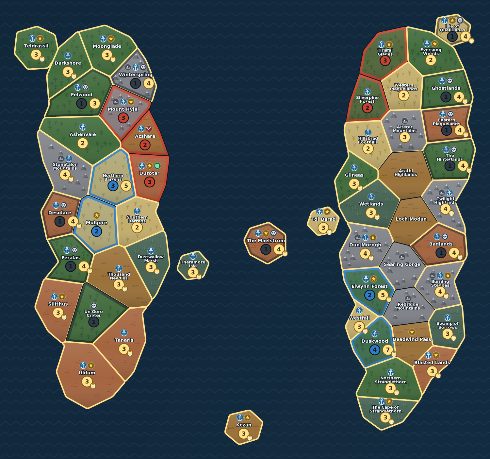

# Small World of Azeroth

Juego de conquista por turnos ambientado en Azeroth, jugable en el navegador.
Proyecto de fans inspirado en **Small World of Warcraft** (Days of Wonder / Blizzard):
todo el mapa, el arte y el código están redibujados desde cero, sin usar materiales originales.

▶ **Jugar:** https://over84sp.github.io/Small-World-of-Warcraft/



## Qué incluye

- **Arte vectorial propio**: textura de terreno dibujada por región (árboles, picos, cultivos,
  cañaverales, dunas) y símbolos de reglas como SVG nítidos — nada de emoji, que cada
  sistema dibuja distinto. La propiedad se marca con una banda del color del jugador
  pegada al borde, para que el terreno siga siendo identificable.
- **Mapa de Azeroth generado por Voronoi**: 53 regiones reales (Durotar, Tirisfal, Un'Goro, Tanaris…)
  repartidas en Kalimdor, los Reinos del Este y varias islas, con adyacencias y costas calculadas
  automáticamente a partir de la geometría.
- **Tres tableros**: Kalimdor (2 jugadores), Reinos del Este (3) y Azeroth completo (4-5).
- **16 razas y 20 poderes** que se combinan al azar en cada partida (Múrlocs Saqueadores,
  Pandaren Voladores, Enanos Mercaderes…).
- **Reglas completas del núcleo**: coste de conquista, montañas, desembarcos por mar (⚓),
  tribus perdidas, dado de refuerzo, redespliegue, declive y puntuación.
- **IA** para los rivales, con heurística de valor/coste por región, gestión de riesgo y
  decisión de cuándo mandar su raza al declive.
- **Hotseat**: de 1 a 5 humanos en el mismo navegador; el resto son bots.
- **Tutorial interactivo** de 13 pasos: se juega sobre el motor real, con el tablero preparado
  para cada lección (desembarco, montañas, tribus perdidas, combate, dado, redespliegue, declive).
- **Adaptado a móvil**: layout de mapa + panel deslizante, zoom con pellizco y arrastre,
  objetivos táctiles de 44 px y confirmación en dos toques.
- **Deshacer** (Ctrl+Z o el botón ↶) para revertir cualquier acción de tu turno.
- **Guardado automático** en `localStorage` tras cada jugada: cierra la pestaña y continúa
  donde lo dejaste desde la pantalla inicial.

## Desarrollo

```bash
npm install
npm run dev        # servidor de desarrollo
npm run build      # build de producción en dist/
npm run genmap     # regenera el mapa desde scripts/mapSeeds.ts
npm run check      # todo: tipos + IA + reglas + guardado + tutorial
npm run sim        # 200 partidas IA vs IA para equilibrar
npm run rulestest  # regresión de reglas (dado fallido, diplomacia)
npm run savetest   # el guardado sobrevive a JSON ida y vuelta
npm run tuttest    # comprueba que el guion del tutorial es jugable de principio a fin
npm run navtest    # comprueba la navegación del tutorial (rebobinado al ir atrás)
```

### Estructura

```
scripts/mapSeeds.ts   geografía a mano: contornos de continentes + semillas de región
scripts/genmap.ts     Voronoi + recorte + adyacencias -> src/game/mapData.generated.ts
src/game/abilities.ts razas y poderes (cada uno son unos pocos hooks)
src/game/engine.ts    motor de reglas puro, sin dependencias de React
src/ai/bot.ts         IA
src/ui/               mapa SVG, pantalla de configuración, tema
```

Añadir una raza o un poder nuevo es solo añadir un objeto a `src/game/abilities.ts`;
el motor y la IA lo recogen automáticamente.

## Despliegue

Cada push a `main` publica en GitHub Pages mediante `.github/workflows/deploy.yml`.
En el repositorio: **Settings → Pages → Source: GitHub Actions**.

## Aviso legal

Warcraft y Small World of Warcraft son marcas de Blizzard Entertainment y Days of Wonder.
Este es un proyecto no comercial hecho por fans, sin afiliación ni assets oficiales.

<!-- desplegado en https://over84sp.github.io/Small-World-of-Warcraft/ -->
